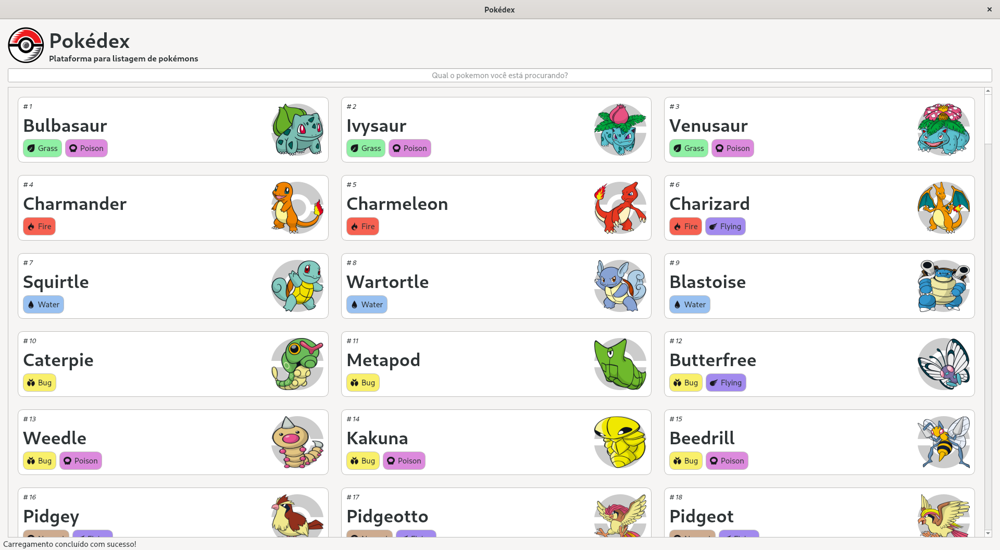

# Pokedex
 Projeto para listagem de pokemons com o uso da API pokeapi utilizando PyQt5

  

## Projeto

### Funcionalidades
- [x] ** Listagem dos pokémons**: Listar os pokémons com o uso da API REST.
- [x] ** Buscar pokémons**: Método para filtrar os pokémons a partir do seu nome.

### Funcionalidades futuras
- [ ] **Selecionar pokémon**: Criar uma página na aplicação com mais detalhes sobre o pokémon escolhido.

- [ ] **Criar seções do pokémons**: Separar as informações do pokémon em três seções: Sobre, Estatísticas, Evoluções.

- [ ] **Seção Sobre**: Dados básicos sobre o pokémon, como altura, peso, fraquezas.

- [ ] **Seção Estatísticas**: Pontos de batalha do pokémon, como vida, ataque, defesa, velocidade, especial ataque e especial defesa.

- [ ] **Seção Evoluções**: Construir a árvore de evolução do pokémon.

### Conceitos abordados

- Consumo de API com o uso da lib [request](https://docs.python-requests.org/)

## Instalação e execução

## Agradecimentos
